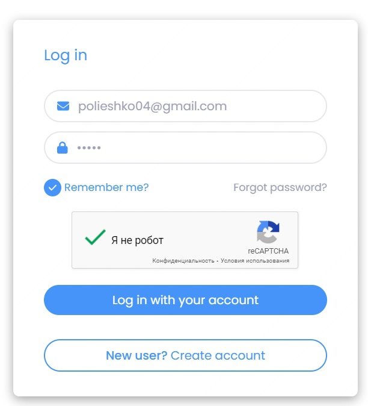
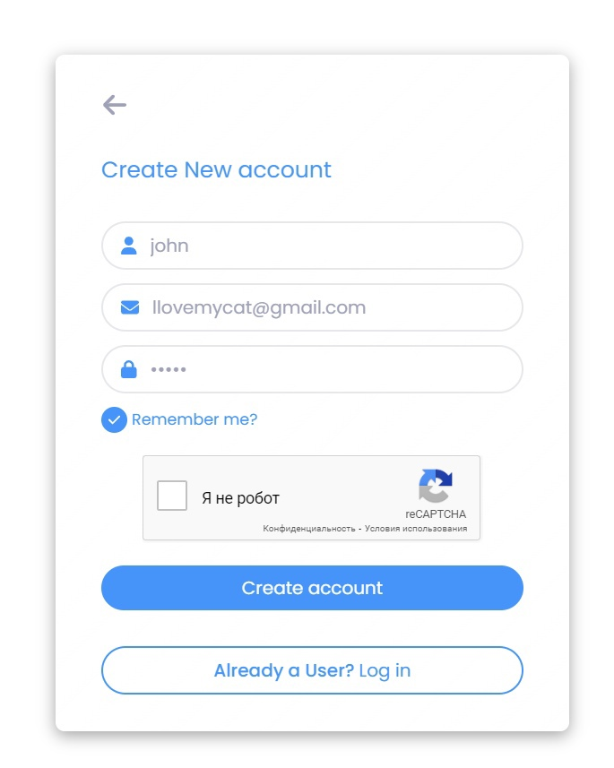
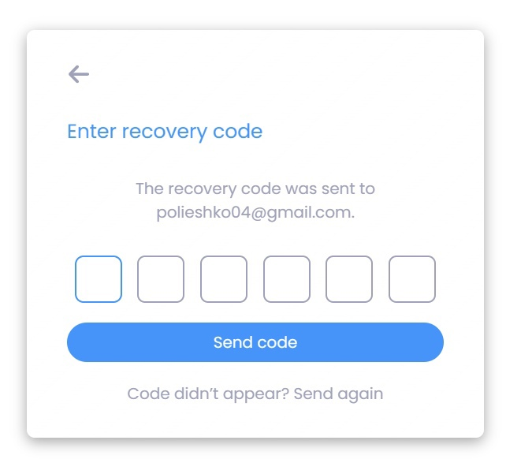
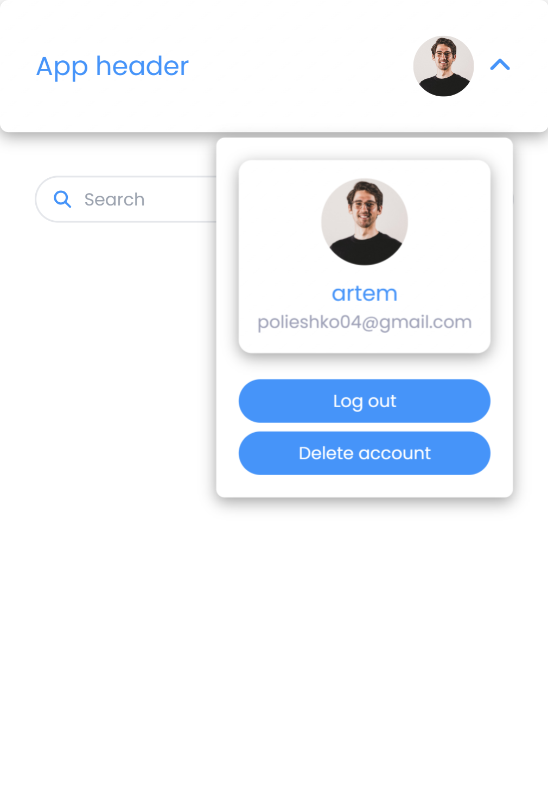

# JWT авторизация с возможностью восстановления пароля
---

## Старт проекта
1. Клиентская часть
    - ```cd .\client\ ```
    - ```npm run dev```
2. Серверная часть
    - ```cd .\server\```
    - ```npm run dev```
    - в файле db.sql код для восстановления бд
---

## Цель работы
Цель работы заключается в изучении работы json web token, а также в применении его в фуллстек приложении авторизации

## Реализация
### Серверная часть
Серверная часть реализована с помощью четырех слоев:
1. Маршрутизаторы (слой, перехватывающий запросы)
2. Контроллеры (слой, обрабатывающий запросы и формирующий ответы)
3. Сервисы (слой, предназначенный для выделения бизнес логики приложения)
4. Слой доступа к данным(слой для взаимодействия с бд)
### Клиентская часть
Клиентская часть реализована с помощью redux потока данных:
1. При возникновении события в dispatch передается action (в моем случае через генератор, предоставляемый срезом)
2. Action передается в Reducer, который обновляет состояние приложения, хранящееся в Store
3. UI (компоненты React) обновляются при изменении данных в store, пользователь видит актуальную информацию
---

## Используемые технологии
#### 1. Клиентская часть:
- react, typescript, react-redux, redux toolkit, react-dom
- tailwind, materialui, fontawesome
- axios
#### 2. Серверная часть: 
- nodejs, express, postgresql, typescript
- jwt, nodemailer, recaptcha
---

<figure align="center">
  
  <figcaption>Страница авторизации</figcaption>
</figure>

---

<figure align="center">
  
  <figcaption>Страница регистрации</figcaption>
</figure>

---

<figure align="center">
  
  <figcaption>Страница ввода кода восстановления</figcaption>
</figure>

---

<figure align="center">
  
  <figcaption>Приватный маршрут</figcaption>
</figure>
